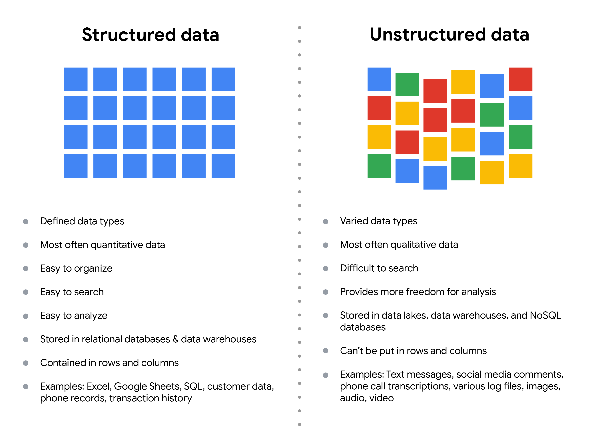

Los Datos están en todas partes y pueden almacenarse de muchas maneras. Existen dos categorías generales de Datos:

- Datos estructurados: Organizados en un formato determinado, como filas y columnas.

- Datos no estructurados: No organizados de ninguna forma fácil de identificar.

Por ejemplo, cuando valora su restaurante favorito en Internet, está creando datos estructurados. Pero cuando utiliza Google Earth para ver una imagen por satélite de la ubicación de un restaurante, está utilizando datos no estructurados.

A continuación le refrescamos las características de los datos estructurados y no estructurados:

Esta ilustración tiene cuadrados alineados y no alineados para columnas de datos estructurados y no estructurados. Los detalles se indican a continuación.Structured data: 
- Defined data types
- Most often quantitative data
- Easy to organize
- Easy to search
- Easy to analyze
- Stored in relational databases
- Contained in rows and columns
- Examples: Excel, Google Sheets, SQL, customer data, phone records, transaction history

Unstructured data:
- Varied data types
- Most often qualitative data
- Difficult to search
- Provides more freedom for analysis
- Stored in data lakes and NoSQL databases
- Can't be put in rows and columns
- Examples: Text messages, social media comments, phone call transcriptions, various log files, images, audio, video

### Datos estructurados
Como hemos descrito antes, los Datos estructurados se organizan en un formato determinado. Esto facilita su almacenamiento y consulta para las necesidades del negocio. Si los datos se exportan, la estructura va junto con los datos.

### Datos no estructurados
LosDatos no estructurados no pueden organizarse de ninguna manera fácilmente identificable. Y en el mundo hay muchos más datos no estructurados que estructurados. Archivos de vídeo y audio, archivos de texto, contenidos de Redes sociales, imágenes de satélite, presentaciones, archivos PDF, respuestas abiertas a encuestas y páginas web son todos ellos tipos de datos no estructurados. 

### El Problema de la Equidad
La falta de estructura hace que los datos no estructurados sean difíciles de buscar, gestionar y analizar. Pero los recientes avances en inteligencia artificial y algoritmos de aprendizaje automático están empezando a cambiar esta situación. Ahora, el nuevo reto al que se enfrentan los científicos de Datos es asegurarse de que estas herramientas sean inclusivas e imparciales. De lo contrario, ciertos elementos de un conjunto de datos estarán más ponderados y/o representados que otros. Y como está aprendiendo, un conjunto de datos injusto no representa con exactitud a la población, lo que provoca resultados sesgados, bajos niveles de exactitud y análisis poco fiables.

