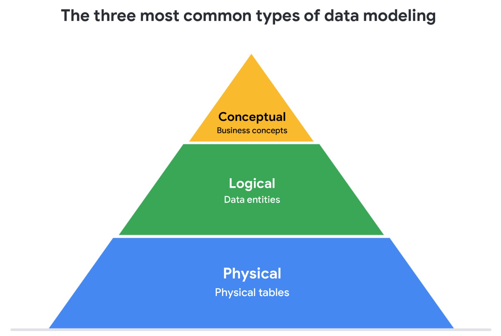
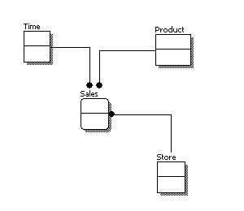
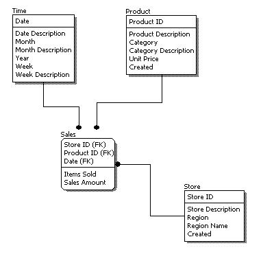
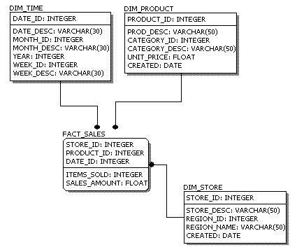

Esta lectura le introduce en el Modelamiento de datos y en los diferentes tipos de modelos de datos. Los Modelos de datos ayudan a mantener la coherencia de los datos y permiten a la gente trazar un mapa de cómo se organizan los datos. Una comprensión básica facilita que los analistas y otras partes interesadas den sentido a sus datos y los utilicen de la forma adecuada. 

**Nota importante**: Como Analista de datos junior, no se le pedirá que diseñe un Modelo de datos. Pero es posible que se encuentre con modelos de datos existentes que su organización ya tiene en marcha. 

## ¿Qué es el Modelamiento de datos?
El **Modelamiento de datos** es el proceso de creación de diagramas que representan visualmente cómo están organizados y estructurados los datos. Estas representaciones visuales se denominan modelos de datos. Puede pensar en el Modelamiento de datos como en el plano de una casa. En un momento dado, puede haber electricistas, carpinteros y fontaneros utilizando ese plano. Cada uno de estos constructores tiene una relación diferente con el plano, pero todos lo necesitan para comprender la estructura general de la casa. Los modelos de datos son similares; los distintos usuarios pueden tener necesidades de datos diferentes, pero el Modelo de datos les permite comprender la estructura en su conjunto.

## Niveles de Modelamiento de datos
Cada nivel de Modelamiento de datos tiene un nivel de detalle diferente. 

pirámide con los tres tipos comunes de Modelamiento de datos: conceptual, lógico y físico

1. El **Modelado conceptual** de datos ofrece una visión de alto nivel de la estructura de datos, por ejemplo, cómo interactúan los datos en una organización. Por ejemplo, se puede utilizar un Modelo conceptual de datos para definir los requisitos empresariales de una nueva base de datos. Un Modelo de datos conceptual no contiene detalles técnicos. 

2. El**Modelado lógico** de datos se centra en los detalles técnicos de una base de datos, como las relaciones, los atributos y las entidades. Por ejemplo, un Modelo lógico de datos define cómo se identifican de forma única los registros individuales en una base de datos. Pero no detalla los nombres reales de las tablas de la base de datos. Ese es el trabajo de un Modelo físico de datos.

3. El **Modelado físico de datos** describe cómo funciona una base de datos. Un Modelo físico de datos define todas las entidades y atributos utilizados; por ejemplo, incluye los nombres de las tablas, los nombres de las columnas y los tipos de datos de la base de datos.

## Técnicas de Modelado de datos

Existen muchos enfoques a la hora de desarrollar modelos de datos, pero dos métodos comunes son el Diagrama de Relación de Entidades (ERD) y el diagrama de Lenguaje Unificado de Modelado (UML) . Los ERD son una forma visual de entender la relación entre entidades en el Modelo de datos. Los diagramas UML son diagramas muy detallados que describen la estructura de un sistema mostrando las entidades del sistema, los atributos, las operaciones y sus relaciones. Como analista de datos junior, deberá comprender que existen diferentes técnicas de Modelamiento de datos, pero en la práctica, probablemente utilizará la técnica existente en su organización.

## Análisis de datos y Modelamiento de datos

El Modelado de datos puede ayudarle a explorar los detalles de alto nivel de sus datos y cómo se relacionan a través de los sistemas de información de la organización. El Modelado de datos a veces requiere un análisis de datos para comprender cómo se componen los datos; de ese modo, sabrá cómo mapearlos. Y, por último, los Modelos de datos facilitan que todos los miembros de su organización comprendan sus datos y colaboren con usted en ellos. ¡Esto es importante para usted y para todos los miembros de su Equipo!